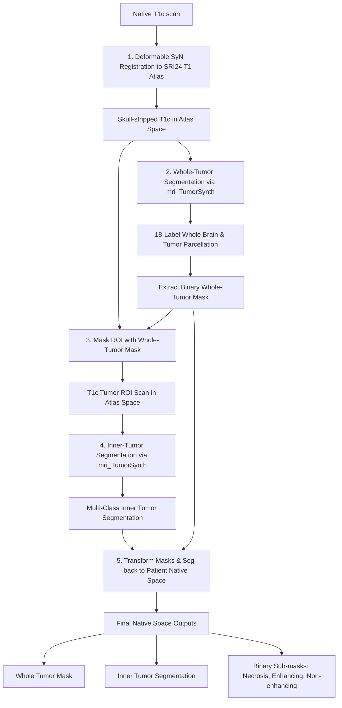

# Brain Tumor Segmentation Tutorial with TumorSynth

A standalone, clean, and structured tutorial showing how to use **TumorSynth** for multi-class brain tumor segmentation. It demonstrates how to take native T1c MRI scans, align them to a common atlas (SRI24), run TumorSynth to segment the whole tumor and inner tumor sub-structures, and transform the segmentations back to the original patient space.

---

## 🗺️ Pipeline Overview

The pipeline processes a native T1c MRI scan to extract both whole-tumor and inner-tumor substructures in native space. It is split into 4 distinct phases:



---

## 📂 Project Structure

Here is an overview of the components in this workspace:
- 📄 [run_tumorsynth.py](file:///Users/felix/GitHub/IGL-TumorSynth-Tutorial/run_tumorsynth.py): Main entry-point script to run the complete pipeline.
- 📄 [config.py](file:///Users/felix/GitHub/IGL-TumorSynth-Tutorial/config.py): Global configurations (default GPU usage flag, local TumorSynth paths, and sub-structure label mappings).
- 📄 [registration.py](file:///Users/felix/GitHub/IGL-TumorSynth-Tutorial/registration.py): Spatial alignment using `antspyx` (SyN registration to atlas and nearest-neighbor inverse warping back to native space).
- 📄 [segmentation.py](file:///Users/felix/GitHub/IGL-TumorSynth-Tutorial/segmentation.py): Integrates the pipeline with `mri_TumorSynth` CLI execution and extracts specific masks.
- 📄 [utils.py](file:///Users/felix/GitHub/IGL-TumorSynth-Tutorial/utils.py): Utility helpers for terminal commands and execution logging.
- 📁 `tools/tumorsynth/`:
  - 📄 [mri_TumorSynth](file:///Users/felix/GitHub/IGL-TumorSynth-Tutorial/tools/tumorsynth/mri_TumorSynth): Bash wrapper script around `nnUNet_predict` inference.
  - 📄 [create_nnUNet_v1.7_env.sh](file:///Users/felix/GitHub/IGL-TumorSynth-Tutorial/tools/tumorsynth/create_nnUNet_v1.7_env.sh): Environment setup script for automated `nnUNet v1` installation.
  - 📄 [nnUNet_v1.7_path.sh](file:///Users/felix/GitHub/IGL-TumorSynth-Tutorial/tools/tumorsynth/nnUNet_v1.7_path.sh): Environment variables export template script.
  - 📁 `nnUNet_v1.7/`: The directory hierarchy housing pre-trained model weights (both Task002 Whole Tumor and Task003 Inner Tumor) and dataset presets.
- 📁 `assets/`:
  - 📁 `sample_scans/`: Contains raw patient native space `.nii.gz` scans (e.g. `UCSF-PDGM-0004_T1c.nii.gz`).
  - 📁 `SRI24_atlas/`: Holds the SRI24 T1 template and brain mask required for registration.

---

## 🛠️ Prerequisites & Environment Setup

To run this pipeline, you need to set up a Python environment with `antspyx` and the `nnUNet` v1 library, and install FSL.

### 1. Install FSL (FMRIB Software Library)
The local `mri_TumorSynth` CLI wrapper depends on FSL tools (`fslmaths`, `fslmerge`, etc.) for mask processing and majority voting.
- Ensure FSL is installed and configured in your `PATH`. Refer to the [FSL Installation Guide](https://fsl.fmrib.ox.ac.uk/fsl/fslwiki/FslInstallation) if needed.
- Verify FSL is available in your shell:
  ```bash
  which fslmaths
  ```

### 2. Set Up the Conda Environment
The repository includes [create_nnUNet_v1.7_env.sh](file:///Users/felix/GitHub/IGL-TumorSynth-Tutorial/tools/tumorsynth/create_nnUNet_v1.7_env.sh) to automate the environment installation.

Run the following commands to create the environment (e.g., `nnUNet_v1.7`) and link the prepackaged model weights:

```bash
cd tools/tumorsynth
chmod +x create_nnUNet_v1.7_env.sh

# Run the installer (adjust path to conda.sh if conda is installed elsewhere)
./create_nnUNet_v1.7_env.sh \
  -e /opt/anaconda3/etc/profile.d/conda.sh \
  -n nnUNet_v1.7 \
  -m models \
  -d .
```

> [!NOTE]
> If you choose to manually set up your conda environment, ensure you install:
> - Python 3.10
> - PyTorch (with GPU CUDA support if running on a GPU-enabled Linux machine)
> - nnUNet v1 (cloned at commit `7f1e273fa1021dd2ff00df2ada781ee3133096ef`)
> - `antspyx` (via `pip install antspyx`)

### 3. Sourcing Environment Paths
`nnUNet` reads the model path configuration from environment variables. After creating the environment, a path helper script [nnUNet_v1.7_path.sh](file:///Users/felix/GitHub/IGL-TumorSynth-Tutorial/tools/tumorsynth/nnUNet_v1.7_path.sh) is generated in `tools/tumorsynth/`.

You must export these environment variables before running the pipeline:
```bash
source tools/tumorsynth/nnUNet_v1.7_path.sh
```

> [!TIP]
> To configure these variables to load automatically whenever you activate the environment:
> ```bash
> mkdir -p $CONDA_PREFIX/etc/conda/activate.d
> cp tools/tumorsynth/nnUNet_v1.7_path.sh $CONDA_PREFIX/etc/conda/activate.d/
> ```

---

## 🚀 Running the Pipeline

Ensure your Conda environment is activated and variables are sourced:
```bash
conda activate nnUNet_v1.7
source tools/tumorsynth/nnUNet_v1.7_path.sh
```

Run the pipeline by providing the path to a T1c NIfTI scan:
```bash
python run_tumorsynth.py assets/sample_scans/UCSF-PDGM-0004_T1c.nii.gz -o outputs -c
```

### Command Line Arguments
| Argument | Description |
| :--- | :--- |
| `input_t1c` | (Required) Path to the native T1c `.nii.gz` scan. |
| `-o`, `--output-dir` | (Optional) Path to save the outputs. Defaults to the same directory as the input scan. |
| `-a`, `--atlas-dir` | (Optional) Path to the SRI24 atlas templates. Defaults to `assets/SRI24_atlas/`. |
| `-g`, `--gpu` | (Optional) Flag to run TumorSynth with GPU acceleration. |
| `-c`, `--cleanup` | (Optional) Flag to delete intermediate atlas-space files and transforms, keeping only final native-space segmentations. |

---

## 📊 Outputs & Sub-structures

For an input scan (e.g. `UCSF-PDGM-0004_T1c.nii.gz`), a dedicated subfolder `outputs/UCSF-PDGM-0004_T1c/` will be created with the following files:

### Final Native-Space Outputs
These files represent the final segmentations mapped back to the original patient space:
- 📄 `UCSF-PDGM-0004_T1c_whole_tumor_mask.nii.gz`: Binary mask of the whole tumor.
- 📄 `UCSF-PDGM-0004_T1c_inner_tumor_seg.nii.gz`: Multi-label segmentation mapping out the sub-structures inside the tumor.
- 📄 `UCSF-PDGM-0004_T1c_non_enhancing_mask.nii.gz`: Binary mask of NET (Non-enhancing tumor) & Edema.
- 📄 `UCSF-PDGM-0004_T1c_necrosis_mask.nii.gz`: Binary mask of NCR (Necrotic core).
- 📄 `UCSF-PDGM-0004_T1c_enhancing_mask.nii.gz`: Binary mask of ET (Enhancing tumor ring).

### Intermediate Atlas-Space Outputs (Deleted if using `-c` / `--cleanup`)
- 📄 `UCSF-PDGM-0004_T1c_t1c_SRI24.nii.gz`: Registered, skull-stripped native T1c image in SRI24 atlas space.
- 📄 `tumorsynth_wt_raw_SRI24.nii.gz`: Raw 18-label brain tissue and whole-tumor parcellation.
- 📄 `UCSF-PDGM-0004_T1c_whole_tumor_mask_SRI24.nii.gz`: Binary whole-tumor mask in atlas space.
- 📄 `UCSF-PDGM-0004_T1c_t1c_roi_SRI24.nii.gz`: Masked T1c scan isolating the tumor region in atlas space.
- 📄 `tumorsynth_it_raw_SRI24.nii.gz`: Raw inner-tumor segmentation in atlas space.
- 📄 ANTs registration transform files (`.mat` and `.nii.gz` warp fields).

---

### 🏷️ Inner Tumor Sub-structure Label Mapping
The inner tumor segmentation outputs the following BraTS-compliant label values (defined in [config.py](file:///Users/felix/GitHub/IGL-TumorSynth-Tutorial/config.py)):

| Label Value | Sub-structure Name | Clinical Description | Output Filename |
| :---: | :--- | :--- | :--- |
| **0** | Background | Healthy brain tissue / non-tumor regions | — |
| **1** | `non_enhancing` | Non-enhancing tumor (NET) / Edema | `*_non_enhancing_mask.nii.gz` |
| **2** | `necrosis` | Necrosis Core (NCR) | `*_necrosis_mask.nii.gz` |
| **3** | `enhancing` | Enhancing Tumor ring (ET) | `*_enhancing_mask.nii.gz` |
